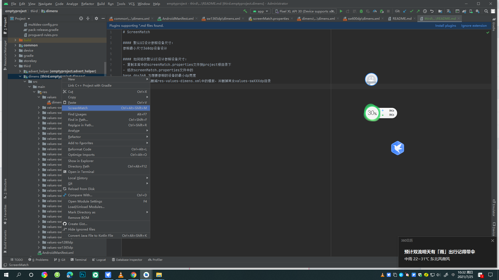
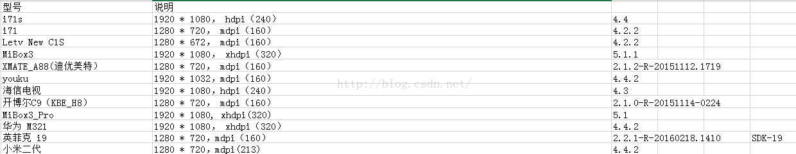

# ScreenMatch

#### 默认UI设计参照设备尺寸：
参照最小尺寸360dp设备设计

#### 如何修改默认UI设计参照设备尺寸：
- 复制本库中的template/screenMatch.properties文件到project根目录下
- 修改screenMatch.properties文件中的
base_dp=360 为想要参照的设备的最小dp宽度
- 更加需要增加或删减res-values-dimens.xml中的模版，并删掉其余values-swXXXdp目录
- 使用ScreenMatch Plugin。如图，，点击ScreenMatch重新生成即可

#### TV常见尺寸
